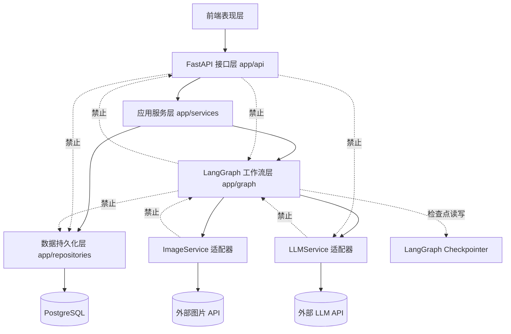
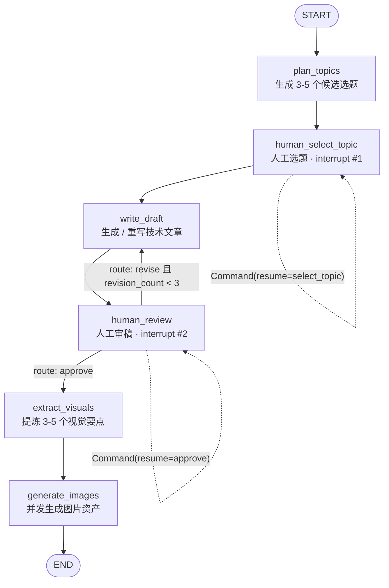

# 自媒体内容运营 AI 智能体 · 技术方案设计（v2）

> 项目：面向 AI 编程培训机构的自媒体内容运营 AI 智能体
> 目标平台：小红书（3–5 张知识卡片 + 精简文案）、微信公众号（完整技术文章）
> 技术栈：Python 3.11+ / FastAPI / LangGraph 1.0+ / Pydantic v2 / PostgreSQL / SQLAlchemy 2.x 异步
> 本文档为**设计文档**，不含实现代码。第一版全部使用 Mock 数据，不调用真实 LLM 与图片 API。
>
> **v2 相对 v1 的关键变更**：审核上限不再自动放行；`route_after_review` 回归纯路由；Graph 不再依赖 Repository；`revision_count` 语义统一；开发阶段重新划分；S1–S3 剥离幂等键与业务表；`image_urls` 升级为 `image_assets`；明确异常传播策略。

---

## 目录

1. [需求边界](#1-需求边界)
2. [总体架构](#2-总体架构)
3. [LangGraph 工作流](#3-langgraph-工作流)
4. [AgentState 设计](#4-agentstate-设计)
5. [节点与路由职责](#5-节点与路由职责)
6. [后端目录结构](#6-后端目录结构)
7. [API 契约](#7-api-契约)
8. [数据持久化边界](#8-数据持久化边界)
9. [分阶段开发计划](#9-分阶段开发计划)
10. [风险检查](#10-风险检查)
11. [已确认决策与待确认事项](#11-已确认决策与待确认事项)

---

## 1. 需求边界

### 1.1 当前必须实现

| 编号 | 功能 | 说明 |
|---|---|---|
| F1 | 创建内容生产会话 | 服务端生成 `thread_id`，输入内容方向后启动工作流 |
| F2 | AI 生成候选选题 | 一次产出 3–5 个候选选题 |
| F3 | 人工选题中断 | 工作流暂停，等待人工指定题目后才能继续 |
| F4 | AI 生成技术文章 | 基于选中题目生成公众号长文 |
| F5 | 人工审稿中断 | 暂停等待人工「通过 / 驳回」 |
| F6 | 驳回重写循环 | 驳回时携带修改意见，回到写作节点重新生成；上限 3 次，达上限后**只能人工通过** |
| F7 | 视觉要点提炼 | 从终稿提炼 3–5 个小红书知识卡片要点 |
| F8 | 图片生成 | 依据视觉要点生成图片，逐张返回结构化结果 |
| F9 | 结果聚合输出 | 一次返回：公众号文章、视觉要点、图片资产列表 |
| F10 | 会话状态查询 | 通过 `thread_id` 查询任意时刻的状态与当前允许的人工动作 |
| F11 | Mock 适配层 | LLM 与图片服务全部走 Mock 实现，接口契约与真实实现一致 |

### 1.2 当前明确不实现

- 登录 / 鉴权 / 多租户 / 权限体系
- 支付、计费、配额
- RAG、知识库检索、向量数据库
- 自动发布到小红书 / 公众号（含 Cookie、扫码、平台风控）
- 视频生成、音频生成、数字人
- 微服务拆分、消息队列、独立任务调度集群
- 会话列表接口（`GET /workflows`）
- 请求级幂等键（`idempotency_key`）
- 业务数据库与业务表（S6 才引入）
- SSE / WebSocket 流式输出
- 真实 LLM、真实图片 API 的接线（仅保留适配器接口与开关）

### 1.3 第一版（S1–S3）完成标准

1. 单机执行 `uvicorn app.main:app` 即可启动，不依赖 PostgreSQL（使用内存 Checkpointer）。
2. 用 HTTP 客户端可完整跑通一次闭环：`start → 取状态 → resume(select_topic) → 取状态 → resume(revise) → 取状态 → resume(approve) → 取到 image_assets`。
3. 连续驳回 2 次再通过时，最终 `revision_count == 2`，且通过前从未进入 `extract_visuals`。
4. 连续驳回 3 次后，会话停留在 `awaiting_review`，继续 `revise` 返回 `REVISION_LIMIT_REACHED`，只有 `approve` 才能推进。
5. 两个中断点都能被识别为「待办动作」，`pending_action.allowed_actions` 与实际可执行动作一致。
6. 任一普通节点发生不可恢复错误时，返回统一 HTTP 错误码，而不是继续沿正常边流向 `END`。
7. 所有外部能力均由 Mock 实现，代码库中不存在任何硬编码密钥。
8. 关闭 Mock 开关后，真实适配器类可被装配进来（允许抛 `NotImplementedError`，但结构必须打通）。

---

## 2. 总体架构

### 2.1 分层职责

| 层 | 目录 | 职责 | 明确不做 |
|---|---|---|---|
| 前端表现层 | `frontend/`（S4） | 展示流程进度、承载两个人工中断的交互 | 不做业务校验、不直连数据库 |
| FastAPI 接口层 | `app/api/` | HTTP 路由、Pydantic 入参校验、异常→状态码映射、响应组装 | 不写业务逻辑、不碰图内部结构 |
| 应用服务层 | `app/services/workflow_service.py` | 会话生命周期编排：启动图、读取中断、投递恢复命令、**所有业务表写入**、异常映射 | 不直接调 LLM/图片 SDK |
| LangGraph 工作流层 | `app/graph/` | 状态定义、节点实现、条件路由、中断与恢复、检查点装配 | 不感知 HTTP、不直接建客户端、**不读写任何业务表** |
| AI 服务适配层 | `app/services/llm/`、`app/services/image/` | 统一能力接口 + Mock/真实实现，把第三方返回规范化为领域结构 | 不做流程控制、不写库 |
| 数据持久化层 | `app/repositories/`、`app/models/`（S6） | 业务表 CRUD 与 ORM 模型，**只被应用服务层调用** | 不承载工作流状态机语义、不被 Graph 调用 |

### 2.2 依赖方向（单向，禁止反向）



依赖规则：

1. **Graph 只依赖三个东西**：`LLMService`、`ImageService`、`Checkpointer`。不依赖 Repository、不依赖 SQLAlchemy、不依赖 FastAPI。
2. `workflow_session`、`review_log`、`content_artifact` 三张业务表**只由 `WorkflowService` 通过 Repository 写入**；节点函数内不得出现任何数据库调用。
3. 适配器实例在应用启动时（`lifespan`）创建一次，通过**构图时闭包注入**传给节点；节点函数内部绝不 `new` 客户端。
4. `app/core/config.py` 是唯一的配置来源，任何层都从此读取，不读 `os.environ`。
5. `app/api/**` 不直接与 Graph 交互，只调用 `WorkflowService`。

### 2.3 为什么 Graph 不能碰业务表

- **恢复重跑风险**：被中断的节点在恢复时会从头重跑，若节点内含落库逻辑，会造成重复写入；而 `WorkflowService` 是在「图调用返回之后」统一落库，天然只执行一次。
- **事务边界**：图的一次推进可能产生多条业务记录（文章版本 + 审核流水），需要在同一事务内提交，这个边界只有在服务层才成立。
- **可替换性**：Graph 保持「纯编排」，未来换存储、加缓存、加审计都不需要改动节点代码。

---

## 3. LangGraph 工作流



节点集合：`plan_topics`、`human_select_topic`、`write_draft`、`human_review`、`extract_visuals`、`generate_images`、`END`。

三条出边说明（**`extract_visuals` 有且仅有一个入口：人工 approve**）：

| 出边条件 | 下一节点 | 说明 |
|---|---|---|
| `review_action == "approve"` | `extract_visuals` | 唯一通往生图的路径 |
| `review_action == "revise"` 且 `revision_count < MAX_REVISIONS` | `write_draft` | 正常驳回重写，重写后 `revision_count += 1` |
| `review_action == "revise"` 且 `revision_count >= MAX_REVISIONS` | `human_review` | **图侧兜底**：不允许放行，重新回到审稿中断点 |

**MAX_REVISIONS = 3** 的两道防线：

1. **主防线（接口层）**：`WorkflowService` 在处理 `revise` 前先读状态，若 `revision_count >= 3`，直接返回 `409 REVISION_LIMIT_REACHED`，**不调用图**。此时状态不发生任何变化，仍为 `awaiting_review`。
2. **兜底防线（图侧）**：即使有人绕过接口直接驱动图，`route_after_review` 也只会把流程送回 `human_review`，`extract_visuals` 在任何情况下都无法在缺少人工 `approve` 时被到达。

`human_review` 第二次执行时，其 `interrupt` 载荷会带上 `revision_limit_reached: true` 且 `allowed_actions: ["approve"]`，前端据此隐藏驳回入口；此为节点重入时的载荷重算，**需在 S2 实测确认中断重入语义**。

> ⚠️ 版本提示：`StateGraph`、`START`/`END`、`interrupt()`、`Command(resume=...)`、条件边自环、`aupdate_state()`、检查点类路径在 LangGraph 1.x 的 1.0 发布前后有过模块调整。以下三处在编码阶段必须按**实际安装版本**实测确认：① 中断载荷的读取位置（`tasks[].interrupts` 或返回值 `__interrupt__`）；② 有条件边回到自身节点时的重入与再次中断行为；③ `aupdate_state()` 是否可用于「仅标记失败状态」的补写。

---

## 4. AgentState 设计

状态统一命名为 `MediaWorkflowState`，定义为 `TypedDict`，所有字段必须是可 JSON 序列化的基础类型（`str` / `int` / `bool` / `None` / `list` / `dict`），**禁止**放入连接池、Engine、Session、HTTP Client、Logger、异常对象。

| 字段名 | Python 类型 | 写入节点 | 读取节点 | 允许为空 | 业务含义 |
|---|---|---|---|---|---|
| `topic_direction` | `str` | 初始输入（`start` 接口） | `plan_topics` | 否 | 运营人员输入的内容方向 |
| `generated_topics` | `list[dict]`（`{id,title,angle,reason}`） | `plan_topics` | `human_select_topic` | 初始为空列表 | 候选选题集合，供人工挑选 |
| `selected_topic` | `dict \| None` | `human_select_topic` | `write_draft` | 选题前为 `None` | 人工选中的题目 |
| `article_content` | `str \| None` | `write_draft` | `human_review`、`extract_visuals` | 写作前为 `None` | 当前版本的技术文章正文 |
| `review_action` | `Literal["approve","revise"] \| None` | `human_review` | 路由函数 `route_after_review` | 审核前为 `None` | 人工审核结论 |
| `review_feedback` | `str \| None` | `human_review` | `write_draft` | `approve` 时为 `None` | 驳回修改意见，重写输入 |
| `visual_points` | `list[dict]`（`{id,order,title,point,prompt}`） | `extract_visuals` | `generate_images` | 提炼前为空列表 | 小红书知识卡片要点 + 生图提示词；`id` 用于与图片资产对齐 |
| `image_assets` | `list[ImageAsset]` | `generate_images` | API 响应、S6 业务持久化 | 生图前为空列表 | 逐张图片的结构化结果，见 4.1 |
| `status` | `str`（`WorkflowStatus` 枚举值） | `plan_topics`、`human_select_topic`、`write_draft`、`human_review`、`extract_visuals`、`generate_images`；异常场景由 `WorkflowService` 补写 | API、路由函数、持久化 | 否（有默认值） | 当前阶段，驱动前端展示与接口校验 |
| `error_message` | `str \| None` | `generate_images`（局部降级警告）；`WorkflowService`（不可恢复错误） | API 响应 | 正常时为 `None` | 可读错误/警告信息 |
| `revision_count` | `int` | `write_draft` | `route_after_review`、`human_review`、API | 否（默认 `0`） | 已按人工意见重写的次数，见 4.2 |

### 4.1 `ImageAsset` 结构

```text
ImageAsset = {
  "visual_point_id": str,      # 对应 visual_points[i].id，用于精确定位
  "status": str,               # "success" | "failed"
  "url": str | None,           # 成功时为图片地址；失败时为 None（或占位图地址，由 ImageService 决定）
  "error": str | None          # 失败原因，成功时为 None
}
```

设计要点：并发调用必须显式携带 `visual_point_id`，**不允许依赖返回顺序**与 `visual_points` 做下标对齐（并发完成顺序不确定）。任何消费方都应以 `visual_point_id` 做匹配；缺失项视为失败项。

### 4.2 `revision_count` 语义（统一约定）

| 事件 | `revision_count` |
|---|---|
| 初稿生成完成（`review_feedback` 为空） | `0`（不增加） |
| 第 1 次驳回后重写完成 | `1` |
| 第 2 次驳回后重写完成 | `2` |
| 第 3 次驳回后重写完成 | `3`（达到 `MAX_REVISIONS`，此后禁止再驳回） |
| 连续驳回两次再通过 | 最终值为 `2` |

实现约定：`write_draft` 只在**本次为重写**（进入节点时 `review_feedback` 非空）时才 `+= 1`；初稿不得计数。`revision_count` 到达 3 后，图只允许 `approve`。

### 4.3 其他约定

- `status` 取值：`planning` → `awaiting_topic_selection` → `drafting` → `awaiting_review` → `revising` → `extracting_visuals` → `generating_images` → `completed` / `completed_with_warnings` / `failed`。
- **`thread_id` 不放进 State**：它属于运行时配置（`config.configurable.thread_id`），由服务端生成。
- 审核历史不放进 State：属于业务审计数据，S6 落 `review_log`；State 只保留「本轮」结论。
- 列表字段采用「整体覆盖」语义（节点返回完整列表），不使用 `operator.add` 累加，因为恢复重跑会产生重复项。

---

## 5. 节点与路由职责

### 5.1 `plan_topics`

| 项 | 内容 |
|---|---|
| 输入 | `topic_direction` |
| 输出 | `generated_topics`（3–5 条）、`status="awaiting_topic_selection"` |
| 调用服务 | `LLMService.plan_topics(direction) -> list[TopicCandidate]` |
| 可能错误 | 上游超时/限流（`LLMUnavailableError`）；结构化解析失败（`LLMResponseParseError`）；结果为空或数量不在 3–5（`ContentValidationError`） |
| 错误处理 | **直接抛出，不在节点内捕获**，由 `WorkflowService` 统一映射 |
| 下一步 | 无条件进入 `human_select_topic` |

### 5.2 `human_select_topic`（人工中断点 #1）

| 项 | 内容 |
|---|---|
| 输入 | `generated_topics`（构造中断载荷） |
| 输出 | `selected_topic`、`status="drafting"` |
| 调用服务 | 无（纯人工决策点） |
| 可能错误 | 恢复值 `topic_id` 不在 `generated_topics` 中（`TopicNotFoundError`）；动作类型不是 `select_topic`（`ActionNotAllowedError`） |
| 下一步 | `write_draft` |

### 5.3 `write_draft`

| 项 | 内容 |
|---|---|
| 输入 | `selected_topic`、`review_feedback`（首轮为空）、`revision_count` |
| 输出 | `article_content`（整体覆盖）、`status="awaiting_review"`、**重写时** `revision_count += 1` |
| 调用服务 | `LLMService.write_article(topic, feedback) -> str` |
| 可能错误 | 上游超时/限流；正文为空、过短或超长（`ContentValidationError`） |
| 下一步 | 无条件进入 `human_review` |
| 幂等要求 | 同一输入重复执行产出等价结果；本轮结果整体覆盖上一轮，禁止追加 |

### 5.4 `human_review`（人工中断点 #2）

| 项 | 内容 |
|---|---|
| 输入 | `article_content`、`revision_count` |
| 输出 | `review_action`、`review_feedback`、`status="revising"` 或 `"extracting_visuals"` |
| 调用服务 | 无 |
| 中断载荷 | `allowed_actions` 由 `revision_count` 决定：`< 3` 时为 `["approve","revise"]`；`>= 3` 时为 `["approve"]` 且 `revision_limit_reached=true` |
| 可能错误 | 恢复动作非法（`ActionNotAllowedError`）；`revise` 未带反馈（`ContentValidationError`） |
| 下一步 | 条件路由（见 5.7） |
| 注意 | 节点只写「本轮的 `review_action` / `review_feedback` + `status`」，不做任何「自动放行」判断 |

### 5.5 `extract_visuals`

| 项 | 内容 |
|---|---|
| 输入 | `article_content` |
| 输出 | `visual_points`（3–5 条，每条含唯一 `id` 与生图 `prompt`）、`status="generating_images"` |
| 调用服务 | `LLMService.extract_visual_points(article) -> list[VisualPoint]` |
| 可能错误 | 结构化解析失败（`LLMResponseParseError`）；数量越界（`ContentValidationError`） |
| 下一步 | `generate_images` |
| 说明 | 本节点只在人工 `approve` 之后才会被执行；只负责调用服务与写状态，数量异常直接抛错，不做静默容错 |

### 5.6 `generate_images`

| 项 | 内容 |
|---|---|
| 输入 | `visual_points` |
| 输出 | `image_assets`（长度与 `visual_points` 一致，逐项带状态）、`status`、`error_message` |
| 调用服务 | `ImageService.generate(prompt, size, visual_point_id)`，用 `asyncio.gather(..., return_exceptions=True)` 并发执行 |
| 可能错误 | 单张失败（超时/内容审核拒绝）；全部失败 |
| 结果策略 | 全部成功 → `status="completed"`；部分成功 → `status="completed_with_warnings"` 且 `error_message` 记录失败摘要；**全部失败 → 抛 `ImageGenerationFailedError`**，由服务层映射为 `502` |
| 下一步 | `END` |
| 说明 | 这是**唯一**允许降级继续的节点；降级只体现为「部分 `ImageAsset.status="failed"`」，绝不掩盖为全成功 |

### 5.7 路由函数 `route_after_review`

**纯函数**：只读 `review_action` 与 `revision_count`，**只返回下一节点名，不写任何状态字段**（不修改 `status`、不写 `error_message`）。

| 输入条件 | 返回值 |
|---|---|
| `review_action == "approve"` | `"extract_visuals"` |
| `review_action == "revise"` 且 `revision_count < MAX_REVISIONS` | `"write_draft"` |
| `review_action == "revise"` 且 `revision_count >= MAX_REVISIONS` | `"human_review"`（停留中断点，不放行） |
| `review_action` 为其他值 | `"human_review"`（防御性兜底，不放行） |

约束：路由函数内不得调用 `aupdate_state`、不得调用服务、不得产生副作用；所有状态变化必须发生在节点内。

### 5.8 人工中断如何暂停与恢复

**暂停（节点内 `interrupt()`）**

1. 节点入口第一步调用 `interrupt(payload)`，`payload` 为可序列化字典，例如选题点 `{"type":"topic_selection","topics":[...],"allowed_actions":["select_topic"]}`，审核点 `{"type":"article_review","article":...,"revision_count":n,"allowed_actions":[...],"revision_limit_reached":false}`。
2. 调用后节点挂起，检查点写入当前状态与中断信息，`ainvoke` 返回。
3. `WorkflowService` 读取状态与中断信息（`aget_state`），归一化为 API 的 `pending_action`。
4. 客户端据此渲染「待选题」或「待审稿」，并按 `allowed_actions` 决定可提交的动作。

**恢复**

1. 客户端调用 `POST /resume`，`WorkflowService` 先做状态校验（是否处于中断、动作是否在 `allowed_actions` 内、驳回是否超限）。
2. 校验通过后构造 `Command(resume=<payload>)`，用同一 `thread_id` 再次执行 `ainvoke`；被中断节点**从函数开头重新执行**，`interrupt()` 直接返回恢复值而不再挂起。
3. 节点写状态，流程继续流转。

关键约束：

- `interrupt()` 必须位于节点入口且**无条件执行**，不得放在 `if` 分支之后。
- 中断前的代码只做纯计算，不得有任何副作用。
- 旧式写法 `compile(interrupt_before=[...])` + `aupdate_state()` 与本方案语义不同，不采用。

### 5.9 异常策略（统一约定）

| 类型 | 处理方式 |
|---|---|
| 普通节点的不可恢复错误 | 节点内**不捕获**，抛出统一领域异常（`LLMUnavailableError`、`LLMResponseParseError`、`ContentValidationError`、`ActionNotAllowedError`、`TopicNotFoundError`、`ImageGenerationFailedError` 等） |
| 领域异常传播 | 异常穿透图调用返回给 `WorkflowService`；由其在 `app/core/exceptions.py` 的映射表中翻译为 HTTP 状态码与错误码 |
| 失败状态记录 | `WorkflowService` 捕获领域异常后，用 `aupdate_state(config, {"status":"failed","error_message":...})` 将失败标记写回检查点，使后续 `GET` 能反映失败（**仅标记状态，不做业务落库；可用性需按实际版本实测**） |
| 图片部分失败 | **唯一可降级场景**：写 `status="completed_with_warnings"`，逐项在 `image_assets` 中给出结构化失败信息，流程正常到 `END` |
| 图片全部失败 | 视为不可恢复，抛 `ImageGenerationFailedError` → `502` |
| 禁止行为 | 不得使用「捕获所有异常后继续走正常边」的写法；不得把异常吞掉只写日志 |

---

## 6. 后端目录结构

```text
yy_agent/
├── .env.example                     # 环境变量模板（含说明注释）
├── .gitignore                       # 忽略 .env / __pycache__ / .venv
├── requirements.txt                 # 依赖清单（含中文注释）
├── README.md                        # 启动与联调说明
├── docs/
│   └── 技术方案设计.md              # 本文档
├── app/
│   ├── __init__.py
│   ├── main.py                      # FastAPI 实例、lifespan、异常处理器、路由挂载（S1 仅健康检查）
│   ├── core/
│   │   ├── config.py                # Pydantic Settings 读取环境变量 + 单例（含 MAX_REVISIONS、Mock 开关）
│   │   ├── db.py                    # SQLAlchemy 异步 engine/sessionmaker（S6 启用，S1–S3 不参与启动流程）
│   │   ├── logging.py               # 结构化日志配置（S10 增强）
│   │   └── exceptions.py            # 领域异常定义 + 到 HTTP 状态码/错误码的映射表
│   ├── api/
│   │   ├── deps.py                  # 依赖注入：ServiceContainer、WorkflowService
│   │   └── v1/
│   │       ├── router.py            # /api/v1 路由聚合
│   │       └── endpoints/
│   │           └── workflows.py     # start / get / resume 三个端点（S3）
│   ├── schemas/
│   │   ├── common.py                # 错误响应体等通用模型
│   │   ├── workflow.py              # 请求/响应模型；resume 用判别联合（discriminated union）
│   │   └── domain.py                # TopicCandidate / VisualPoint / ImageAsset 等领域模型
│   ├── services/
│   │   ├── container.py             # 服务容器：按配置装配 Mock/真实适配器
│   │   ├── workflow_service.py      # 启动/恢复/状态查询、业务落库、异常映射（唯一业务写入方）
│   │   ├── llm/
│   │   │   ├── base.py              # LLMService 抽象接口
│   │   │   ├── mock.py              # 确定性 Mock 实现（S1）
│   │   │   └── openai_client.py     # 真实实现占位（S7）
│   │   └── image/
│   │       ├── base.py              # ImageService 抽象接口
│   │       ├── mock.py              # 返回本地静态占位图 URL（S1）
│   │       └── real_client.py       # 真实实现占位（S8）
│   ├── graph/
│   │   ├── state.py                 # MediaWorkflowState、WorkflowStatus、ImageAsset 等结构（S1）
│   │   ├── builder.py               # 组装 StateGraph、注册节点/边/条件边、编译（S2）
│   │   ├── routing.py               # route_after_review 等纯路由函数（S2）
│   │   ├── checkpointer.py          # 按配置返回内存或 PostgreSQL Checkpointer（S2 / S5）
│   │   └── nodes/
│   │       ├── plan_topics.py               # S2
│   │       ├── human_select_topic.py        # S2
│   │       ├── write_draft.py               # S2
│   │       ├── human_review.py              # S2
│   │       ├── extract_visuals.py           # S2
│   │       └── generate_images.py           # S2
│   ├── repositories/                # S6：仅被 WorkflowService 调用
│   │   ├── session_repository.py
│   │   ├── artifact_repository.py
│   │   └── review_repository.py
│   ├── models/                      # S6：ORM 模型
│   │   ├── base.py
│   │   ├── workflow_session.py
│   │   ├── content_artifact.py
│   │   └── review_log.py
│   └── static/mock/                 # Mock 阶段占位图片
└── tests/
    ├── conftest.py                  # app/client/容器 fixture
    ├── unit/                        # 路由函数、Mock 适配器、State 序列化
    ├── integration/                 # 全流程闭环、中断恢复、驳回循环与上限
    └── api/                         # 三个端点的契约与错误码
```

平滑替换设计（Mock → 真实）：

- `base.py` 定义接口，`mock.py` / 真实实现同签名，替换只改 `container.py` 的装配逻辑。
- 开关来自配置：`LLM_PROVIDER=mock|openai`、`IMAGE_PROVIDER=mock|real`。
- 领域模型（`schemas/domain.py`）是节点与适配器之间的唯一契约，第三方 SDK 原始结构不得越过适配器边界。
- S1–S3 不引入 `repositories/`、`models/`（目录可先不创建），保证第一版只依赖 `thread_id` + 内存 Checkpointer。

---

## 7. API 契约

统一约定：

- 基础路径 `/api/v1`，请求/响应均为 `application/json`。
- 成功直接返回业务对象；失败返回 `{"detail": {"code": "...", "message": "...", "thread_id": "..."}}`。
- **S1–S3 的请求体不包含 `idempotency_key`，响应体不包含 `created_at` / `updated_at`**；这些字段在 S6 统一引入。
- 错误码清单：

| 错误码 | HTTP | 触发条件 |
|---|---|---|
| `VALIDATION_ERROR` | 422 | 入参不满足 Pydantic 约束 |
| `THREAD_NOT_FOUND` | 404 | `thread_id` 不存在 |
| `WORKFLOW_NOT_INTERRUPTED` | 409 | 当前不处于中断点（流程运行中或已结束） |
| `ACTION_NOT_ALLOWED` | 409 | 动作与当前中断类型不匹配，或不在 `pending_action.allowed_actions` 内 |
| `TOPIC_NOT_FOUND` | 422 | `topic_id` 不在候选选题中 |
| `REVISION_LIMIT_REACHED` | 409 | `revision_count >= MAX_REVISIONS(3)` 时再次提交 `revise` |
| `LLM_UNAVAILABLE` | 503 | 文本模型上游不可用 |
| `LLM_RESPONSE_PARSE_ERROR` | 502 | 模型返回无法解析为约定结构 |
| `CONTENT_VALIDATION_ERROR` | 502 | 生成内容不符合校验规则（空/过短/超长/数量越界） |
| `IMAGE_GENERATION_FAILED` | 502 | 图片全部生成失败 |
| `INTERNAL_ERROR` | 500 | 未预期异常 |

### 7.1 启动工作流

`POST /api/v1/workflows/start`

请求体：

```json
{
  "topic_direction": "面向零基础学员讲清楚 LangGraph 的检查点机制"
}
```

`topic_direction`：必填，2–200 字符。`thread_id` 由服务端生成并在响应中返回。

成功响应 `201 Created`：

```json
{
  "thread_id": "b1f0c2a6-8d3e-4b2f-9f61-2c7a5e9d1234",
  "status": "awaiting_topic_selection",
  "topic_direction": "面向零基础学员讲清楚 LangGraph 的检查点机制",
  "generated_topics": [
    {"id": "t1", "title": "检查点到底存了什么", "angle": "原理拆解", "reason": "新手最困惑的点"},
    {"id": "t2", "title": "一次断点续跑的完整复盘", "angle": "实战演练", "reason": "可复现"},
    {"id": "t3", "title": "为什么你的状态总是丢", "angle": "避坑指南", "reason": "痛点明确"}
  ],
  "pending_action": {
    "type": "topic_selection",
    "allowed_actions": ["select_topic"]
  }
}
```

错误：`422 VALIDATION_ERROR`；`503 LLM_UNAVAILABLE`；`502 LLM_RESPONSE_PARSE_ERROR` / `CONTENT_VALIDATION_ERROR`；`500 INTERNAL_ERROR`。

### 7.2 查询会话状态

`GET /api/v1/workflows/{thread_id}`

请求体：无。

成功响应 `200 OK`：

```json
{
  "thread_id": "b1f0c2a6-8d3e-4b2f-9f61-2c7a5e9d1234",
  "status": "awaiting_review",
  "topic_direction": "面向零基础学员讲清楚 LangGraph 的检查点机制",
  "generated_topics": [{"id": "t1", "title": "检查点到底存了什么", "angle": "原理拆解", "reason": "新手最困惑的点"}],
  "selected_topic": {"id": "t1", "title": "检查点到底存了什么", "angle": "原理拆解", "reason": "新手最困惑的点"},
  "article_content": "……正文……",
  "review_action": null,
  "review_feedback": null,
  "visual_points": [],
  "image_assets": [],
  "revision_count": 1,
  "error_message": null,
  "pending_action": {
    "type": "article_review",
    "allowed_actions": ["approve", "revise"],
    "revision_count": 1,
    "revision_limit_reached": false
  }
}
```

达到驳回上限时，`pending_action` 变为：

```json
{
  "type": "article_review",
  "allowed_actions": ["approve"],
  "revision_count": 3,
  "revision_limit_reached": true
}
```

已完成会话中 `image_assets` 示例：

```json
[
  {"visual_point_id": "vp1", "status": "success", "url": "https://cdn.example.com/mock/vp1.png", "error": null},
  {"visual_point_id": "vp2", "status": "failed", "url": null, "error": "image provider timeout after 30s"},
  {"visual_point_id": "vp3", "status": "success", "url": "https://cdn.example.com/mock/vp3.png", "error": null}
]
```

`pending_action` 为 `null` 表示当前无中断（流程运行中或已到 `END`）。已结束时 `status` 为 `completed` / `completed_with_warnings` / `failed`。

错误：`404 THREAD_NOT_FOUND`；`500 INTERNAL_ERROR`。

### 7.3 恢复工作流（承载三种人工动作）

`POST /api/v1/workflows/{thread_id}/resume`

请求体使用 `action` 作为判别字段（Pydantic v2 discriminated union），三种形态：

选题：

```json
{"action": "select_topic", "topic_id": "t1"}
```

通过：

```json
{"action": "approve", "comment": "可以发布"}
```

驳回：

```json
{"action": "revise", "feedback": "第二段缺少代码示例，请补充一个最小可运行例子，并压缩开头铺垫"}
```

约束：`approve` 的 `comment` 可选；`revise` 的 `feedback` 必填且长度 ≥ 5。

成功响应 `200 OK`：返回与 7.2 相同的完整状态结构（恢复并推进到下一个中断点或 `END` 后的最新状态）。

错误：

| 状态码 | 错误码 | 触发条件 |
|---|---|---|
| 404 | `THREAD_NOT_FOUND` | `thread_id` 不存在 |
| 409 | `WORKFLOW_NOT_INTERRUPTED` | 当前不处于中断点（运行中或已结束） |
| 409 | `ACTION_NOT_ALLOWED` | 动作与当前中断类型不匹配（如待选题时传 `approve`） |
| 409 | `REVISION_LIMIT_REACHED` | `revision_count >= 3` 时提交 `revise`（**状态不变，仍停留 `awaiting_review`**） |
| 422 | `TOPIC_NOT_FOUND` / `VALIDATION_ERROR` | `topic_id` 不存在或字段缺失 |
| 502 | `IMAGE_GENERATION_FAILED` | 通过后进入生图且全部失败 |
| 503 | `LLM_UNAVAILABLE` | 恢复后触发写作且上游不可用 |
| 500 | `INTERNAL_ERROR` | 未预期异常 |

三种动作的语义映射：

| action | 合法中断点 | 前置校验 | 状态流转 |
|---|---|---|---|
| `select_topic` | `awaiting_topic_selection` | `topic_id` 必须存在 | → `drafting` → `awaiting_review` |
| `approve` | `awaiting_review` | 无附加限制 | → `extracting_visuals` → `generating_images` → `completed` / `completed_with_warnings` |
| `revise` | `awaiting_review` | `revision_count < 3` 且 `feedback` 非空 | → `revising` → `write_draft`（`revision_count += 1`）→ 再次 `awaiting_review` |

### 7.4 幂等性与重复请求（S1–S3 策略）

S1–S3 不引入 `idempotency_key`，依靠**状态机自身的守卫**保证安全：

- `resume` 之前必须校验当前处于中断点，否则返回 `409 WORKFLOW_NOT_INTERRUPTED`；重复提交同一动作时，第二次就会因为不再处于该中断点而被拒绝。
- 所有状态变更都由 `thread_id` 隔离，不同会话互不影响。
- 请求级幂等键与业务层唯一约束在 S6 与业务表一并引入。

---

## 8. 数据持久化边界

### 8.1 LangGraph Checkpointer 保存什么

- 图运行所需的**框架内部数据**：每个超级步的状态快照、待执行任务、中断信息、通道版本号。
- 以 `thread_id` 为维度组织（对应表名与结构由库版本决定，属内部实现，不对外暴露）。
- 定位：**运行时引擎状态**，用于断点续跑、中断恢复。不是业务数据源。

### 8.2 业务数据库保存什么（S6 引入）

| 表 | 用途 | 关键字段 |
|---|---|---|
| `workflow_session` | 一次内容生产会话 | `thread_id`(唯一)、`topic_direction`、`status`、`revision_count`、`created_at`、`updated_at` |
| `content_artifact` | 最终产出 | `thread_id`、`selected_topic`、`article_content`、`visual_points`(JSONB)、`image_assets`(JSONB)、`version`、`created_at` |
| `review_log` | 人工审核流水 | `thread_id`、`round`、`action`、`comment`、`operator`、`created_at` |

写入方唯一：**`WorkflowService` → Repository**。Graph 节点不写任何业务表（见 2.3）。

### 8.3 两者如何关联

统一使用 `thread_id` 作为唯一桥接字段：

```text
LangGraph Checkpointer (thread_id)  ←── thread_id ──→  workflow_session.thread_id
                                                              │
                                                              ├── content_artifact.thread_id
                                                              └── review_log.thread_id
```

流程约定（S6 生效）：`start` 时先写入 `workflow_session`（`thread_id` 由服务端生成，同时用作图的 `configurable.thread_id`）；此后由服务层在图调用返回后同步关键字段；到 `END` 后写入 `content_artifact`；每次 `resume` 的审核动作写 `review_log`。

### 8.4 为什么不能只靠 Checkpointer

1. **格式不对外**：检查点内容是框架私有编码，版本升级可能变化，不能当作对外契约。
2. **不可业务查询**：无法按「状态/时间/方向」检索与统计，会话列表与运营报表无从实现。
3. **无业务约束**：没有外键、唯一键、字段级校验，也没有 `review_log` 这类审计结构。
4. **生命周期不同**：检查点因回溯与重试频繁增长，可按策略清理；业务数据需长期留存。
5. **职责耦合**：一旦删检查点就丢业务历史；一旦改图结构就可能读不懂旧数据。
6. **并发与一致性**：业务侧需要事务性写入（会话 + 审核记录原子提交），检查点写入不在同一事务边界内。

**结论：Checkpointer 与业务数据库保持分离**，`thread_id` 是唯一关联键。

---

## 9. 分阶段开发计划

| 阶段 | 输入 | 产出 | 验收标准 |
|---|---|---|---|
| **S1 项目骨架 + 领域模型 + Mock 服务** | 本设计、依赖清单 | `main.py`（仅健康检查，无业务接口）、`core/config.py`、`graph/state.py`、`schemas/domain.py`、`services/llm/{base,mock}.py`、`services/image/{base,mock}.py`、`services/container.py` | ① `python -c "import app.main"` 通过，`uvicorn` 可启动并响应健康检查；② 配置项可从 `.env` 读取且缺失必填项时报错清晰；③ Mock `LLMService` 返回符合领域模型的选题/文章/视觉要点；④ Mock `ImageService` 返回可用图片地址；⑤ 对 `MediaWorkflowState` 全字段做 JSON 往返序列化测试通过；⑥ **不涉及**图、节点、中断、HTTP 业务接口、Checkpointer |
| **S2 完整 LangGraph + 人工中断 + 驳回循环** | S1 产物 | `graph/builder.py`、`graph/routing.py`、`graph/checkpointer.py`、6 个节点、内存 Checkpointer 装配 | ① 用脚本直接驱动图跑通「选题 → 写作 → 审核」；② 两个 `interrupt` 均能被识别，`Command(resume=...)` 能正确恢复且节点不重复产生副作用；③ 连续驳回 2 次再通过，`revision_count == 2`，且通过前从未进入 `extract_visuals`；④ 连续驳回 3 次后，图停留在 `awaiting_review` 的再次中断，`allowed_actions == ["approve"]`，无法进入 `extract_visuals`；⑤ `route_after_review` 单测覆盖四种输入且确认无状态写入；⑥ 节点抛出的领域异常能正常穿透返回；⑦ 不涉及 HTTP 接口 |
| **S3 三个 FastAPI 接口 + HTTP 联调** | S2 产物 | `api/deps.py`、`api/v1/endpoints/workflows.py`、`schemas/workflow.py`、`WorkflowService` 的状态查询与中断归一化、`core/exceptions.py` 映射表 | ① 用 HTTP 客户端完整跑通闭环并拿到 `image_assets`；② `resume` 三种动作均可用，非法动作返回 409 且状态不变；③ 越界 `topic_id` 返回 422；④ 超限 `revise` 返回 `REVISION_LIMIT_REACHED` 且状态仍为 `awaiting_review`；⑤ 普通节点错误返回对应错误码（503/502），不出现「假成功」；⑥ 图片部分失败返回 `completed_with_warnings` 且 `image_assets` 含失败明细；⑦ 无 `idempotency_key`、无 `created_at/updated_at`、无业务表 |
| **S4 前端界面** | S3 契约 | 方向输入页、选题页、审稿页（通过/驳回 + 意见，超限时禁用驳回）、结果页（文章 / 要点 / 图片及失败标记） | 两个中断点均可在界面完成；驳回后能看到新版本正文与 `revision_count` 变化；超限时驳回入口不可用；刷新页面可凭 `thread_id` 恢复现场 |
| **S5 PostgreSQL Checkpointer** | S3 产物、可用 PG 实例 | PostgreSQL Checkpointer 装配、建表脚本、`CHECKPOINTER_BACKEND` 开关 | 重启服务后凭 `thread_id` 继续恢复；内存模式与 PG 模式行为一致；连接串与凭据全部来自环境变量；并发会话互不串线 |
| **S6 业务历史记录** | S5 产物 | ORM 模型、三个 Repository、`WorkflowService` 落库逻辑、`created_at/updated_at`、`idempotency_key`、会话列表与详情接口 | 会话/产出/审核流水落库正确；超限驳回尝试可审计；重复请求由幂等键拦截；Checkpointer 清空后业务历史仍完整可查 |
| **S7 真实文本模型** | S6 产物、可用模型 Key | 真实 `LLMService` 实现、超时/重试/结构化输出校验、`LLM_PROVIDER` 切换 | 同一套流程切到真实模型后闭环通过；结构化解析失败映射为 `LLM_RESPONSE_PARSE_ERROR`；Mock 与真实实现可通过配置互切且节点代码零改动 |
| **S8 真实图片模型** | S7 产物、图片服务 | 真实 `ImageService`、并发生成、单张失败降级、结果落对象存储或本地静态目录 | 3–5 张图全部产出；注入单张失败时返回 `completed_with_warnings` 且 `image_assets` 精确对应 `visual_point_id`；全失败返回 502；无密钥入库 |
| **S9 SSE 流式输出** | S8 产物 | `GET /workflows/{thread_id}/stream` 事件流（节点开始/结束、中断、完成） | 前端可实时看到节点推进；中断事件能驱动界面切换；断线重连不重复消费 |
| **S10 日志、指标、限流与降级** | S9 产物 | 结构化日志（含 `thread_id`）、耗时与失败率指标、接口限流、适配器熔断与超时降级 | 单次会话可按 `thread_id` 全链路追踪；触发限流返回 429；上游不可用时返回降级响应而非 500 |

> 阶段纪律：**S1 不得包含任何人工中断或完整审核闭环的验收要求**；S1–S3 不得引入业务表、幂等键与时间戳字段，以保证第一版只依赖 `thread_id` 与内存 Checkpointer。

---

## 10. 风险检查

| 风险 | 现象 | 影响 | 对策 |
|---|---|---|---|
| **LangGraph 版本差异** | 导入路径、`interrupt`/`Command` 语义、检查点表结构随版本变化 | 编译期或运行期错误，返工成本高 | 编码第一步锁定版本（`pip show langgraph`）；不确定 API 集中在 `graph/checkpointer.py`、`graph/builder.py`、`graph/routing.py` 三处；本设计标注的三处（中断载荷读取位置、条件边自环重入、`aupdate_state` 标记失败）必须在 S2 完成当天实测确认 |
| **中断恢复时节点重复执行** | 恢复时节点从头重跑，中断前的副作用会被执行两次 | 数据重复、状态污染 | `interrupt()` 放在节点第一行且无条件；中断前只做纯计算；**节点内不做任何落库**（见 2.3）；恢复值先校验再写状态 |
| **达到上限后误入生图** | 驳回次数用尽仍进入 `extract_visuals`，产出未获人工认可的内容 | 违反人工审核强约束 | 双防线：接口层 `REVISION_LIMIT_REACHED` 拦截 + `route_after_review` 超限时返回 `human_review`；单测断言「非 approve 不可达 `extract_visuals`」；路由函数保持纯函数，不得用改 `status` 的方式旁路放行 |
| **`revision_count` 语义漂移** | 初稿被计数、或重写未计数，导致上限判定错位 | 提前触顶或超限执行 | 明确规定：初稿不计、每次重写 +1；`write_draft` 单测覆盖「初稿=0 / 两次驳回=2 / 三次驳回=3」；路由判定统一使用同一字段 |
| **thread_id 隔离** | 并发会话串状态，或客户端指定 `thread_id` 造成冲突 | 内容错乱，人工审核看到别人的稿子 | `thread_id` **只由服务端生成**；所有图调用强制携带 `config.configurable.thread_id`；测试覆盖并发两会话交错恢复 |
| **状态序列化** | 往 State 里塞 session、client、logger 导致检查点写入失败 | 图报错、恢复失效 | State 只允许基础可 JSON 化类型；依赖通过闭包注入；`ImageAsset` 等结构必须是纯 JSON 结构；保留全字段 JSON 往返单测 |
| **并发生图对应错乱** | 依赖返回顺序与 `visual_points` 下标对齐 | 图片与要点错位，内容不可用 | `ImageAsset` 显式携带 `visual_point_id`；结果以 id 匹配而非顺序；断言 `len(image_assets) == len(visual_points)` 且 id 集合一致 |
| **异常被吞导致假成功** | 捕获所有异常后继续沿正常边走到 `END` | 用户拿到空内容却显示成功 | 只允许图片部分失败降级；其余节点抛统一领域异常交由 `WorkflowService` 映射；代码评审禁止 `except Exception: pass/continue` 写法 |
| **Mock 与真实服务切换** | 切换后返回结构或异常类型不一致 | 上层逻辑被击穿 | 领域模型为唯一契约；适配器负责把上游异常翻译为统一领域异常；S7/S8 用「改配置不改节点」验证；Mock 保留供 CI |
| **重复请求幂等性** | 重复点「通过」或网络重试导致动作投递两次 | 状态被推进两次 | S1–S3：`resume` 前强制校验中断态，重复动作第二次返回 409；S6：补 `idempotency_key` 与 `(thread_id, round, action)` 唯一约束 |
| **API Key 泄露** | 密钥写进代码、日志、异常堆栈或响应体 | 凭据泄漏、费用损失 | 密钥只来自环境变量（`Settings` 校验必填）；`.env` 进 `.gitignore`；日志与错误响应统一脱敏（只输出 provider 名与错误类别）；配置对象不做明文 `repr`；提交前关键词扫描 |

---

## 11. 已确认决策与待确认事项

### 11.1 已确认决策（v2 固化，后续阶段不得随意回退）

| 编号 | 决策 |
|---|---|
| D1 | `MAX_REVISIONS = 3`；达到上限后流程**停留 `awaiting_review`**，继续 `revise` 返回 `REVISION_LIMIT_REACHED`；**未经人工 `approve` 绝不进入 `extract_visuals`** |
| D2 | `route_after_review` 为纯函数，只返回下一节点名，不修改任何状态字段（包括 `status`） |
| D3 | Graph **不依赖 Repository**，节点不读写业务表；`workflow_session`、`review_log`、`content_artifact` 统一由 `WorkflowService` 经 Repository 写入；Graph 只依赖 `LLMService`、`ImageService`、Checkpointer |
| D4 | `revision_count` 表示「按人工意见重写的次数」：初稿为 `0`，每次重写 `+1`；连续驳回两次再通过时最终为 `2` |
| D5 | 阶段划分固定为：S1 骨架与 Mock、S2 图与中断、S3 接口联调、S4 前端、S5 PG Checkpointer、S6 业务历史、S7 真实文本、S8 真实图片、S9 SSE、S10 可观测与限流；S1 不得要求人工审核闭环 |
| D6 | S1–S3 不引入 `idempotency_key`、`created_at`、`updated_at` 与业务表同步，统一推迟到 S6；第一版只依赖 `thread_id` 与 `InMemorySaver` |
| D7 | `image_urls` 调整为 `image_assets: list[ImageAsset]`，含 `visual_point_id` / `status` / `url` / `error`，并发结果按 id 匹配 |
| D8 | 异常策略：普通节点抛统一领域异常，由 `WorkflowService` 映射 HTTP 错误；不捕获所有异常后继续走正常边；**仅图片部分失败**可降级为 `completed_with_warnings` |
| D9 | `thread_id` 只由服务端生成 |
| D10 | 第一版不实现会话列表接口 |
| D11 | 图片部分失败允许完成，但必须返回结构化失败信息（逐项 `status`/`error`） |
| D12 | Checkpointer 与业务数据库保持分离，`thread_id` 为唯一关联键 |

### 11.2 待确认事项（不阻塞 S1）

1. 文章长度与结构约束（建议 800–2000 字，含小标题），超限时是重试还是直接报错？
2. 小红书图片数量由 AI 决定（3–5 张）还是允许人工在审稿时调整？
3. 图片尺寸与风格规范（是否统一竖版封面 + 知识卡片版式）？
4. 错误提示的文案风格：直接返回技术错误信息，还是为运营人员转写为中文友好提示？

### 11.3 进入 S1 前必须完成的动作

1. 确认实际安装的 LangGraph 版本，并核对本设计标注的三处不确定 API。
2. 确认 Mock 图片的存放与访问方式（本地静态目录 vs 占位图服务）。
3. 确认 `MAX_REVISIONS` 是否需要做成配置项（当前设计：来自 `Settings`，默认 3）。
